# 통계학 1주차 정규과제

📌통계학 정규과제는 매주 정해진 분량의 『*데이터 분석가가 반드시 알아야 할 모든 것*』 을 읽고 학습하는 것입니다. 이번 주는 아래의 **Statistics_1st_TIL**에 나열된 분량을 읽고 `학습 목표`에 맞게 공부하시면 됩니다.

아래의 문제를 풀어보며 학습 내용을 점검하세요. 문제를 해결하는 과정에서 개념을 스스로 정리하고, 필요한 경우 추가자료와 교재를 다시 참고하여 보완하는 것이 좋습니다.

1주차는 `1부. 데이터 기초체력 기르기`를 읽고 새롭게 배운 내용을 정리해주시면 됩니다.

## Statistics_1st_TIL

### 1부. 데이터 기초체력 기르기

### 01. 통계학 이해하기

### 02. 모집단과 표본추출

### 03. 변수와 척도

### 04. 데이터의 기술 통계적 측정

### 05. 확률과 확률변수

## Study Schedule

| 주차  | 공부 범위     | 완료 여부 |
| ----- | ------------- | --------- |
| 1주차 | 1부 p.2~56    | ✅         |
| 2주차 | 1부 p.57~79   | 🍽️         |
| 3주차 | 2부 p.82~120  | 🍽️         |
| 4주차 | 2부 p.121~202 | 🍽️         |
| 5주차 | 2부 p.203~254 | 🍽️         |
| 6주차 | 3부 p.300~356 | 🍽️         |
| 7주차 | 3부 p.357~615 | 🍽️         |

# 01. 통계학 이해하기

- 통계학을 배워야하는 이유 

데이터 과학은 기초 통계로부터 발전해 왔으며, 그 의미를 해석함에 있어서도 통계 이론에 기반해야함. 

즉, 누구나 데이터를 다루는 시대가 됐지만 데이터를 효과적으로 다루고자 한다면 언제나 통계학적인 사고가 필요함.

> 데이터과학의 프로세스 
>
> 1. 데이터 수집
> 2. 데이터 가공
> 3. 탐색적 데이터 분석, 데이터 시각화
> 4. M/L 모델링
> 5. 결과 해석 및 적용

데이터과학의 프로세스를 보면 알 수 있듯이, 가공한 데이터를 통해 **탐색적 데이터 분석(EDA)** 를 하여 데이터를 이해하고 해석해야함. -> 효과적인 머신러닝 모델을 기획하고 적용하기가 가능.

그 이후 수많은 테스트와 수정 반복하여 모델의 결과값을 통해 문제점을 찾아내어 개선 방향을 도출하는 것도 통계학에 대한 이해가 뒷받침이 되야함. 

> 가설 설정 : 궁금해하는 현상의 원인을 찾아내고 미래를 예측하기 위해 필요한 과정 

- 머신러닝과 전통적 통계학의 추출

머신러닝의 주된 목적 : **예측(Prediction) **  / 통계학의 주된 목적 : **해석(explanation) **

따라서, 머신러닝은  예측력이 얼마나 높은가에 집중을 해야하고, 그렇기에 분석 모형의 복잡성이 높으며, 고질적인 문제인 **과적합(Overfitting)** 해결에 집중해야함. 또한, 머신러닝은 통계학의 일부 특성을 활용한 응용과학 분야임.

반면에 통계학은, 모델의 신뢰도를 중시하며 복잡성보다는 단순성을 추구함. 각 변수의 영향력에 대한 해석과 모집단에서 추출한 샘플의 가정(Assumption)과 통계적 적합성에 집중함.

> 결론
>
> * 통계학은 우선 가설을 설정하고, 데이터를 확인하고
> * 머신러닝은 데이터를 기반으로 가설을 끌어내어 검증하는 경향이 있다. 

<!-- Week1_1 이미지 추가 -->
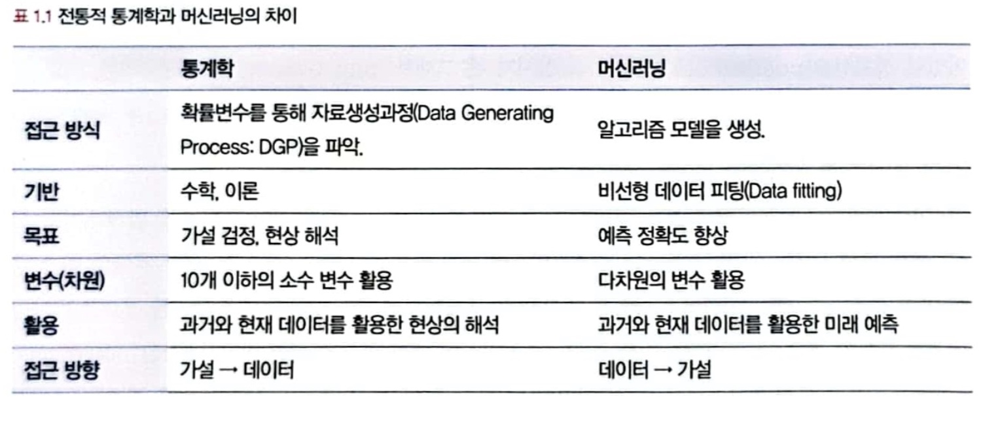

- 통계학 정의와 기원 

통계학: 자료를 수집하고 분석하여 그 분석 결과를 통해 효율적인 의사결정을 하는 기법을 연구하는 학문으로, 기원은 인구조사(군 징집 대상 파악, 세금 걷기 위함, 질병 관리 등)를 통해 생겨남.

> 중요한 통계학 기원
>
> > - 프랜시스 골턴(Francis Galton, 1822~1911) : 회귀분석의 아버지
> >
> >   사분위수(quartile), 백분율(percentile), 표준편차(standard deviation)의 개념에 이름을 붙인 사람
> >
> >   중앙값(median)을 대표값으로 사용하고, '회귀' 더 정확히는 평균으로의 회귀(regression to the mean)을 발견한 사람
>
> > - 칼 피어슨(Karl Pearson, 1875~1936) : 통계학의 아버지
> >
> > 영구에서 태어나서 세상의 모든 사건은 독립적으로 일어나지만 서로 상관관계를 가지고 있기에 상관관계를 맺는 두 변수 중에서 하나의 변수를 알면 다른 변수를 알 수 있다는 상관관계 계수(correlation coefficient)의 개념을 창시
> >
> > 연구 분야가 다양했음(과학론을 비롯한 철학적 분야, 응용수학, 수리통계학, 생물측정하그, 우생학 등)
>
> > - 존 튜키(John Wilder Tukey, 1915~2000) : 미국의 수학자이자 통계학자
> >
> > 통계를 공학과 컴퓨터 과학 분야에 접목하기 위해 끊임없는 노력을 하신 분
> >
> > 탐색적 데이터 분석(EDA) 분야를 창시했고, 이는 현대 데이터 과학의 토대가 됨. 

- 기술 통계화 추론 통계

1. 기술 통계 

기술 통계는 문자 그대로 주어진 데이터의 특성을 사실에 근거하여 설명하고 묘사하는 것을 말함.

> 기술(통계) = descriptive = 서술[묘사]하는, 사실에 근거한, 설명적인, 도형의 

평균 말고도, 중앙값, 최빈값, 가중평균, 기하평균 등 다양한 기법이 존재하고, 기술통계를 내는 것을 데이터 과학에서 EDA(Exploratory Data Analysis)라고 함. 주로 시각화를 많이 사용하여 나타냄

2. 추론 통계

추론 통계는 표본 집단으로부터 모집단의 특성을 추론하는 것이 목적으로, 쉽게 말해 **한 학급의 통계치를 통해 학교 전체 학생의 통계치를 추정하는 것**임. 

> 추론(통계) = inferential = 추리의, 추정에 의한

> 표본의 특성을 분석 -> 특성의 일반화 여부 판단 -> 모집단의 특성으로 추정 

# 02. 모집단과 표본추출

- 모집단과 표본, 전수조사와 표본 조사

통계 분석을 하기 위해서 분석하고자하는 대상의 데이터가 있어야함.

**모집단(population)** : 분석 대상 전체의 집합

**표본(sample)** : 모집단의 부분집합, 모집단의 일부를 추출한 것

**전수조사** : 모집단의 자료 전체를 조사 및 분석하여 정보를 추출하는 것을 전수조사라고 함.

**표본조사** : 모집단에서 추출한 표본을 통해 모집단의 정보(평균, 표준편차 등)를 추정하고 검정하는 것을 표본조사라고 함.

<!-- Week1_2 이미지 추가 -->
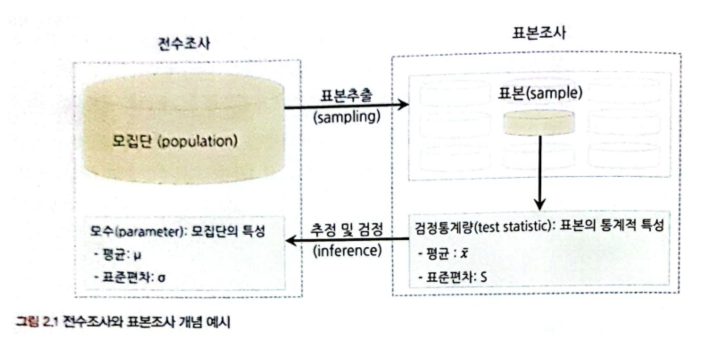

모집단의 자료 전체를 다 조사 및 분석하여 정보를 추출하기 위해서는 방대한 데이터에 따른 컴퓨팅 파워의 부담과, 전체 데이터를 모으기 쉽지 않다는 것에서 단점이 존재. 즉, 표본 추출 방법 하나까지도 데이터 과학의 성과에 큰 영향을 미침. 

> 데이터 안에 다양한 편향과 이상치들도 존재하기에 이를 효과적으로 제거한 표본을 추출해야함.

- 표본조사를 하는 이유와 데이터 과학 적용 방법

분석 기술이 좋아졌다고 해도 분석 모델링 단계에서 전수 데이터를 모두 사용하는 것은 비효율적임. 

따라서 **최종 분석에서는 전체 데이터를 사용하더라도, 분석 모델이 완성될 때까지는 표본 데이터를 활용하는 것이 경제적, 시간적으로 유리함.** 

데이터 가공 및 변환이 수도 없이 일어나기에 **예측 및 분류 모델링 단계에서는 적절한 표본을 추출해서 진행하고 전체 프로세스가 완성됐을 때 전체의 데이터를 사용해 최종적인 모델 성능을 확인하고 예측 및 분류하는 것이 좋다. **

<!-- Week1_3 이미지 추가 -->
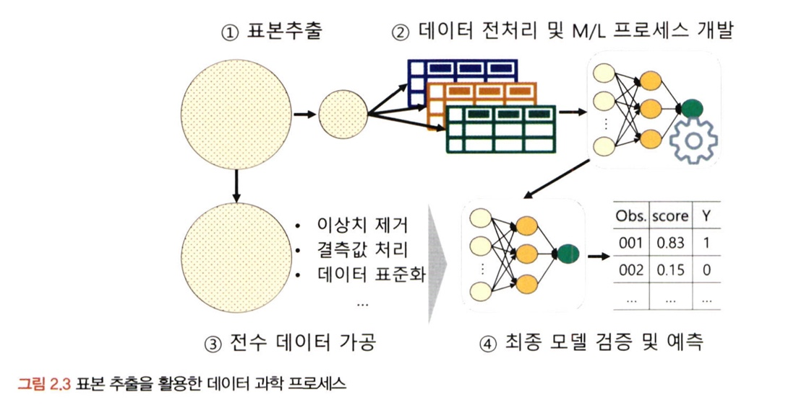

표본 조사를 통해 모집단의 크기를 유추하는 방법에 대해 하나 알아보자.

> 표지 재포획법(marking-and-recapture method) 
>
> 주로 서식지에 사는 생물들의 군집의 밀도를 파악하거나, 유동 인구를 추정할 때 사용. 
>
> ex) 길고양이 100마리르 포획해 표식을 남긴 뒤, 놓아주고 다시 100마리를 잡아서 표식이 있는 고양이의 수를 통해 전체 고양이의 모집단 수를 파악함.

- 표본추출에서 나타나는 편향의 종류

**표본 오차(sampling error)** : 모집단과 표본의 자연 발생적인 변동

**비표본 오차(non-sampling error) ** : 이를 제외한 변동, 비표본 오차의 한 원인은 *편향* 이다. 

> - 편항들의 종류
>
> > 1. 표본추출편향(sample selection bias) : 표본 추출 과정에서 체계적인 경향이 개입되어 모집단에서 편향된 표본만 추출되는 경우
> > 2. 가구편향(household bias) : 모집단의 부분 집단 단위에서 하나의 관측치씩 추출하는 경우 크고 적은 집단이 작고 많은 집단보다 적게 추출되는 경우
> > 3. 무응답편향(non-response bias) : 설문에 응답하지 않는 사람들과 응답하는 사람들에 체계적인 차이가 있는 경우
> > 4. 응답편향(response bias) : 설문 형식의 문제, 응답자의 심리적 이슈에 의해 표본이 영향을 받는 경우
>
> * 브래들리 효과 : 피조사자가 자신의 생각이나 신념을 밝히기 어려워하여 거짓된 응답을 하는 현상 
>
> -> 즉, 사람들의 심리적인 조건에 따라 통계적 편향이 발생할 수도 있음. 

- 인지적 편향의 종류

사람들은 언제나 합리적으로 생각하고 행동하는 것이 아니며, 휴리스틱(heuristic)을 통해 왜곡된 지각으로 결정을 하는 경우가 많다. -- 대니얼 카너먼(Daniel Kahneman)

**1. 확증편향(confirmation bias)**

자신의 본래 믿고 있는 대로 정보를 선택적으로 받아들이고 임의로 판단하는 경향

처음부터 생각해 두었던 가설에 유리한 방향으로 정보를 수집하고 해석하는 것은 명백한 오류이며 분석의 신뢰성을 떨어뜨림.

**2. 기준점 편향(anchoring bias)**

분석가가 가장 처음에 접하는 정보에 지나치게 매몰되는 편향

처음 표본을 통해서 나온 통계가 머리속에 각인되어, 다른 분석 결과를 무시하거나 과소평가를 함

**3. 선택 지원 편향(choice-supportive bias)**

본인이 의사결정을 내리는 순간 그 선택의 긍정적인 부분에 대해 더 많이 생각하고 그 결정에 반대되는 증거를 무시하게 되는 편향

확증 편향과 유사한 개념이지만 주어진 정보들을 통해 의사결정이 이루어진 순간부터 편향성을 가진다는 것에서 차이가 존재

**4. 분모 편향(denominator bias)**

분수 전체가 아닌 분자에만 집중하여 현황을 왜곡하여 판단하게 되는 경향

비율은 분모의 편향의 영향을 받을 수 있기에 분자만 보면 잘못된 판단을 내릴 수 있음.

**5. 생존자 편향(survivorship bias)**

소수의 성공한 사례를 일반화된 것으로 인식함으로써 나타나는 편향 

- 머신러닝 모델 측면의 편향과 분산

편향과 분산은 트레이드 오프 관계

<!-- Week1_4 이미지 추가 -->
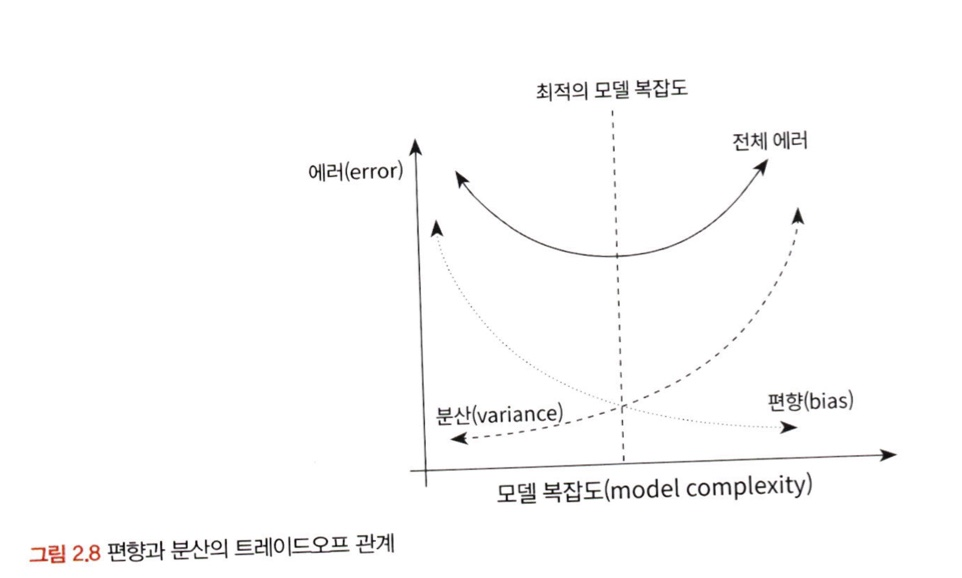

위 사진에서 볼 수 있듯이 모델의 복잡도가 상승할수록 편향은 감소하지만 분산은 증가함. 

- 표본 편향을 최소화하기 위한 표본 추출 방법

> - 표본추출을 두 가지 관점에서 바라볼 수 있음.
>
> 1. 데이터 수집단계의 표본 추출 
> 2. 기업에서 이미 가지고 있는 빅데이터에서 분석 모델링을 위한 적절한 크기의 표본데이터를 추출하는 것 

데이터 수집 단계에서의 표본추출 과정

1. 모집단 확정 
2. 표본 프레임 결정
3. 표본 추출방법 결정
4. 표본크기 결정
5. 표본추출

> 주로 데이터에 이상이 없는 모집단과 표본프레임이 확정이 되면 확률 표본추출과 비확률 표본 추출방법 그리고 복원추출과 비복원추출 중 적절한 방법을 선택해야함. 
>
> 거의 대부분의 경우 확률 표본추출방법을 사용함.

확률 표본추출방법 종류

**1. 단순 임의 추출방법**

모집단의 모든 구성단위가 표본으로 선정될 확률이 동일한 경우

예시로 제비뽑기나 로또 담청 번호 선정이 있음

**2. 계층적 표본추출방법**

모든 구성단위에 일련번호를 부여한 뒤 일정한 간격으로 표본을 선택하는 방법

**3. 층화 표본추출방법**

모집단의 특정한 기준으로 분류가 가능할 때 쓰일 수 있는 방법

**4. 군집 표본추출방법**

층화 표본추출방법처럼 모집단의 특정한 기준으로 분류한뒤, 하나의 소집단을 선택하여 분석하는 방법

**5. 복원추출법(sampling with replacement: SWR)** 

처음 모집단에서 추출된 표본을 되돌려 넣고 표본을 추출하는 방법

**6. 비복원추출법(sampling without replacement :SWOR)**

처음 모집단에서 추출된 표본을 되돌려 넣지 않고 다음 표본을 추출하는 방법

# 03. 변수와 척도

- 변수의 종류

이산변수와 연속변수 : 값들의 정수값만 취하나, 모든 실수값을 취할 수 있나의 차이

**독립변수(independent variable)**와 **종속변수(dependent variable)** 은 원인과 결과의 관계 

<!-- Week1_5 이미지 추가 -->
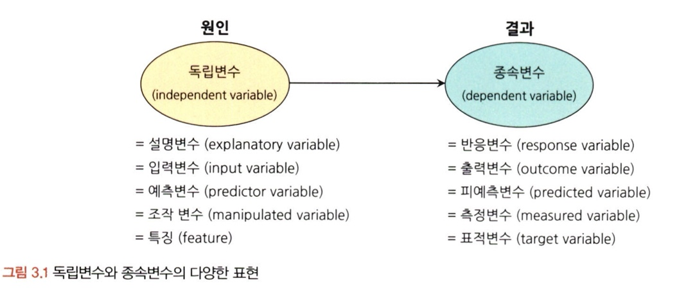

독립변수와 종속변수는 기본적으로 서로 상관관계를 맺고 있음. 

> 상관관계 : 두 변수의 수치가 상관성을 가지고 있다는 것 

유의할 점 : 독립변수 간에도 상관관계를 가질 수 있다는 것 

독립 변수에는 상관관계가 없어야한다. 그 이유는 *독립변수 간의 상관관계가 높으면 독립변수들과 종속변수와의 연솬성을 측정하기 어렵기 때문* 이다. 

- 변수 관계의 종류

**1. 인과관계(causal relationship)**

독립변수와 종속변수의 기본적 관계로 변수가 다른 변수의 원인이 되는 영향을 미친다는 관계. 가장 기본적인 관점

**2.상관관계(correlational relationship)**

변수 간에 관련성이 존재하는 관계. 인과 관계의 상위개념으로 음, 또는 양의 관련을 갖고 있음 

> 독립변수 간에도 상관관계가 있을 수 있으며 이는 다중공선성이라는 문제를 불러 일으킬 수 있음.

**3. 독립관계(independent relationship)**

변수 간에 상관성, 즉 상관계수가 0인 관계. 데이터 분석에 있어 독립변수 간의 서로 독립관계여야함.

**4. 의사관계(spurious relationship)**

변수 간에 상관성은 있지만, 그 상관성이 다른 변수에 의해 나타난 관계. 즉 오류 방지를 위한 단순한 통계 수치에만 연연하지 않고, 변수에 대한 깊은 이해와 함께 논리적인 개연성 파악이 필요함

**5. 양방향적 인과관계(reciprocal causality)**

두 변수가 서로 간에 인과적 영향을 미치는 관계 

**6. 조절관계(moderating relationship)**

독립변수와 종속 변수 사이에서 강하고 불확정적인 영향을 미치는 관계 

**7.매개관계(mediational relationship)**

독립변수와 종속변수의 중간에서 매개변수가 개입되어 독립변수의 여향을 종속변수에 전달하는 관계, 매개변수에는 시간적 차원이 포함돼 있고, 독립변수와 종속변수간의 중간다리 역할을 함. 

- 척도의 종류 

척도란? : 측정하고자 하는 대상을 수치화하는 것에 사용되는 일종의 측정 도구

<!-- Week1_6 이미지 추가 -->
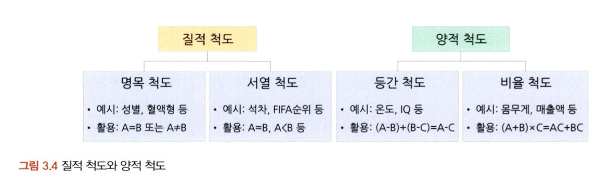

척도의  분류

**질적 척도(범주형 척도)**

> 1. 명목척도(nominal scale) : 조사대상의 속성이나 범주를 구분하기 위한 목적으로 만들어진 척도로, 다른 척도를보다 정보량이 가장 적다는 특징이 있음. 
> 2. 서열척도(ordinal scale) : 조사대상의 속성 크기를 측정하여 대상 간의 순서관계를 측정하는 척도 

**양적 척도(연속형 척도)**

> 1. 등간척도(interval scale) : 서열척도가 가지고 있는 정보와 함께 조사대상이 가지고 있는 속성의 '상대적 크기'의 차이를 비교할 수 있는 정보도 가지고 있는 척도
> 2. 비율척도(ratio scale) : 가장 많은 정보를 담을 수 있는 척도로, 순서에 관한 정보, 대상 간 상대적 크기 정보, 절대적 기준을 통한 비율 정보까지 포함하고 있음. 

<!-- Week1_7 이미지 추가 -->
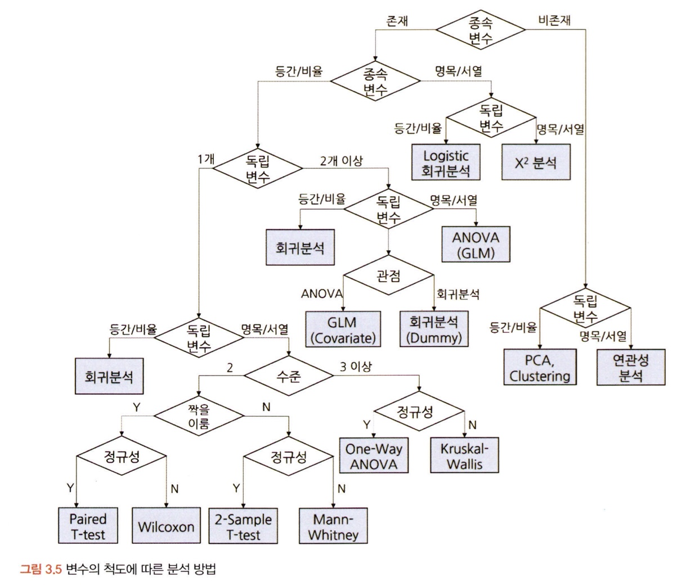

# 04. 데이터의 기술 통계적 측정

- 중심 성향의 측정

데이터가 주어지고 하나의 변수를 선택해 주어진 데이터를 대표할 하나의 값을 제시해라. 라는 질문이 나올 때 어떤 값을 선택? **표본의 중심성향**

> 중심성향에는 평균값, 최빈값, 중앙값이 존재

1. 평균값(mean) : 데이터의 값의 모든 합을 전체 관측치 수로 나누어 구함.

**산술평균(arithmetic mean)**

가장 기본적인 평균 측정 방법으로 전체 변숫값을 모두 더한 후 값들의 개수로 나눠줌. 

**가중평균(weighted mean)**

무거움을 더해서 평균을 구하는 방법, 더 많은 비중을 차지하는 집단에 가중치를 더해 합리적인 평균값을 구하는 방법. 소비자 물가지수와 같은 데이터에 주로 사용

**기하평균(geometric mean)**

고대 그리스 시절 기하적(도형적) 측정에서 시작하여, 일반적으로 시간에 따라 비효율적으로 변화하는 값의 평균을 구할 때 사용. 시간적으로 변화하는 자료인 물가상승률이나 인구 변동률, 증권 수익률 등을 계산할 때 사용

**조화평균(harmonic mean)**

기하평균처럼 시간적으로 변화하는 데이터에서 평균을 측정하는 방법. 차이점은 조화평균은 비율의 평균이 아닌 값의 평균을 구하는 것 

2. 중앙값(median) : 데이터를 큰 수부터 내림차순으로 나열할 때 중앙에 위치한 값, 데이터가 홀수개면 딱 나오지만, 짝수 개일경우 중앙 부근에 있는 두 값의 산술평균 값이 중앙값이 됨. 

3. 최빈값(mode) : 데이터 중 가장 빈도가 높은 값. 평균과 중앙값과 다르게 명목척도나 서열척도로 이루어진 데이터도 측정이 가능하다는 장점이 있음. 

<!-- Week1_8 이미지 추가 -->
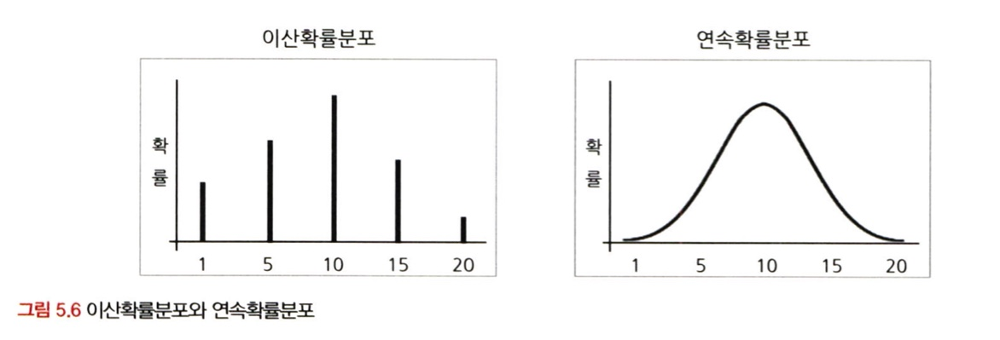

>  이 사진과 같이 데이터의 분포 형태에 따라 대푯값들의 위치가 달라지기에 초반 데이터 형태를 파악하기 위해 평균, 분산, 최소 최댓값 등의 확인이 필요함. 

- 분산과 표준편차

분산과 표준편차 : 데이터의 퍼진 정도를 파악하는 지표

1. 분산(variance) : 산술평균과 각 데이터의 편차를 제곱한 것의 평균

편차는 평균값의 차이기 때문에 더하면 0이 되기 때문에 편차의 절댓값을 모두 더하고 해야함.

2. 표준편차(standard deviation) : 분산에 루트 씌운 것 

*표본의 경우는 관측치의 수(N) 이 아닌 자유도(N-1)로 나눠줘야함.*

> 자유도(degree of freedom) 
>
> 자유롭게 선택할 수 있는 숫자. 표본이 모집단보다 분산이 작게 계산되는 경향이 있기 때문에 표본을 추출하는 목적에서 표본의 의미가 없어질 것을 대비하여 나눠주는 값을 -1 해줌으로써 분산과 비슷하도록 조정을 해주기 위해 사용

- 산포도와 범위 ,사분위수, 변동계수

산포도(dispersion) : 분산도라고도 불리며 **대푯값을 중심으로 자료들이 흩어져 있는 정도를 의미**함. 산포도를 측정하는 방법으로는 <u>범위, 분산, 표준편차, 사분위수 범위, 변동계수</u> 들이 사용

**사분위수(quartile)** 

전체 데이터의 순서에 따른 위치 값을 의미함. 전체범위를 4개로 나눔. Box plot 에 중요한 요소로 사용됨. 

> 1분위수와 3분위수 사이의 범위를 사분위수 범위(interquarilte range, IQR) 이라고 함. 전체 데이터의 50%를 나타냄

**변동계수(coefficient of variation, CV)**

표준편차를 산술평균으로 나눠준 값. 각 자료의 표준편차와 평균을 함께 활용하기 때문에 서로 다른 자료의 산포도를 비교할 수 있음. 

- 왜도와 첨도

**1. 왜도(skewness)**

데이터 분포의 좌우 비대칭도를 표현하는 척도. 데이터의 분포가 얼마나 대칭인가 

> 왜도를 측정하는 방법에는 피어슨의 비대칭 계수(Pearson's skewness coefficients)가 있음. 
>
> 평균, 중앙, 최빈 값의 차이를 비교한 후, 그 차이를 표준편차로 나눈값을 통해 정도를 측정함. 

**2. 첨도(kurtosis)**

분포가 정규분포보다 얼마나 뾰족하거나 완만한지의 정도를 나타내는 척도

데이터가 중심에 많이 몰려있을 수록 뾰족한 모양, 두루 퍼지면 구릉 모양을 뜀. 

> 기준보다 크면 양의 첨도 혹은 급첨
>
> 작으면 음의 첨도 또는 완첨이라고 함. 

- 표준편차의 경험법칙

일반적인 정귭분포에서 표준편차를 통해 데이터 값들의 범위를 가늠 가능함. 

이를 **경험법칙(empirical rule)** 이라함. 아래 사진과 같이 평균과 표준편차를 가지고 특정 범위의 데이터가 어느정도의 비중을 차지하는지 유추가 가능함. 

<!-- Week1_9 이미지 추가 -->
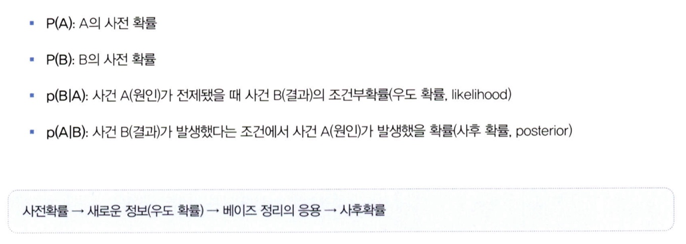

# 05. 확률과 확률변수

- 확률의 기본 개념

**확률**이란, 일정한 조건 안에서 특정 사건이 일어날 수 있는 가능성의 정도를 뜻함. 수치는 0과 1 사이로 표시함. 

> 표본공간(sample space) : 통계적 실험을 통해 발생할 수 있는 모든 사건의 집합
>
> 사건(event) : 표본 점이라고도 불리며, 한 번의 실험을 통해 발생할 수 있는 특정한 결과 혹은 표본공간의 부분집합을 뜻함. <u>즉, 사건은 표본공간 밖에서 만들어질 수 없음.</u>

- 확률의 종류

**1. 비조건확률(unconditional probablity)**

아무런 조건이 없는 상황에서 사건이 일어날 확률을 뜻함. 한계확률이라고도 부름

**2. 결합확률(joint probablity)**

표본공간 안에서 일어나는 사건 각각의 조합으로 이루어지는 확률로 두 개 이상의 사건이 동시에 일어나는 확률을 뜻함. 쉽게 이해하면 사건의 *사건의 교집합*이라고 할 수 있음.

**3. 조건부 확률(conditional probability)**

하나의 사건이 먼저 발생했다는 조건이 전제된 상황에서 또 다른 사건이 발생할 확률이라는 점에서 차이가 존재. 조건을 주어 표본공간을 한정 지은 후에 다른 조건의 확률을 구하기 때문에 결합확률보다는 확률이 높게 나옴. 

- 분할과 베이지안 이론

**분할** 이란 , 사건들을 모두 합할 때 전체 사건들을 포괄하되, 중복이 일어나지 않는 사건들의 집합, 비슷한 말로 MECE(Mutually exclusive, collectively exhaustive) 라고 함.

**베이지안 이론**은 영국의 수학자 *토마스 베이즈(Thomas Bayes, 1701~1761)*가 제시한 확률 이론

<!-- Week1_10 이미지 추가 -->
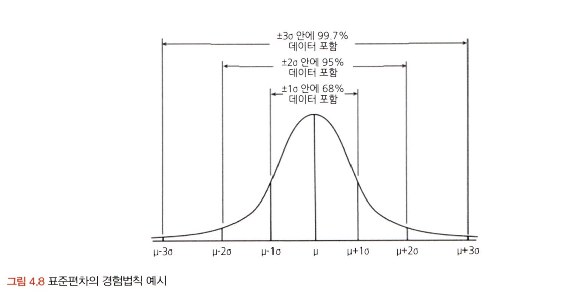

>  요약: 특정한 사건 A가 발생하면 그 사건의 원인이 되는 사건들의 사전 확률을 이용해 사건 A의 원인이 될 수 있는 사후 확률을 알아내는 것
>
> 적절히 활용시에 정확한 결론을 도출하고, 올바른 의사결정이 가능함

- 확률변수의 개념과 종류

**확률 변수(random variable)** 이란 측정 값이 변할 수 있는 확률이 주어진 변수

크게 **이산확률변수**와 **연속확률변수**로 나눌 수 있음.

> 이산확률변수 : 변수가 가질 수 있는 값이 셀 수 있는 실숫값인 변수, 분포를 그려보면 점으로 찍혀서 그릴 수 있음.
>
> 연속확률변수 : 변수가 연속형 값을 가지기 때문에 나올 수 있는 값들을 셀 수가 없음. 특정한 값이 아닌 특정한 구간으로 접근해야함. 

<!-- Week1_11 이미지 추가 -->
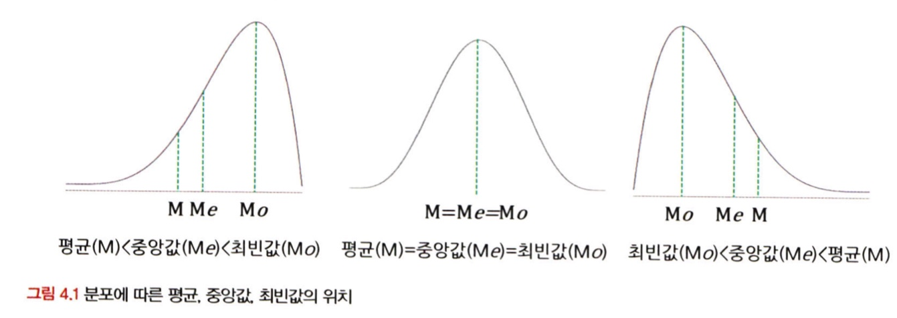

- 심슨의 역설

**심슨의 역설**: 성공률, 합격률, 당첨률 등등의 정보를 들으면 그대로 받아들이는 경향이 있지만, 데이터를 자세히 들여다 보면, 데이터의 **세부 비중**에 따라 전체 대표확률이 왜곡되는 경우가 생길 수 있음. 

> 요약 : 데이터를 어떻게 나누고 결합하고 가공하는가에 따라 결과가 정반대로 바뀔 수 있음을 경계해야함. -> 심슨의 역설의 의의

# 확인 문제

## 문제 1.

> **🧚Q. 한 대형 병원이 두 명의 외과 의사(A와 B)의 수술 성공률을 비교하려고 한다. 과거 1년간의 데이터를 보면, A 의사의 전체 수술 성공률은 80%, B 의사의 전체 수술 성공률은 90%였다. 이 데이터를 본 병원 경영진은 A 의사의 실력이 B 의사보다 별로라고 판단하여 A 의사의 수술 기회를 줄이는 방향으로 정책을 조정하려 한다.
> 그러나 일부 의료진은 이 결론에 의문을 제기했다.
> 그들은 "단순한 전체 성공률이 아니라 더 세부적인 데이터를 분석해야 한다"고 주장했다.**

> **-A 의사의 실력이 실제로 B 의사보다 별로라고 결론짓는 것이 타당한가?   
> -그렇지 않다면, 추가로 확인해야 할 정보는 무엇인가?**

<!--심슨의 역설을 이해하였는지 확인하기 위한 문제입니다-->

<!--학습한 개념을 활용하여 자유롭게 설명해 보세요. 구체적인 예시를 들어 설명하면 더욱 좋습니다.-->

'심슨의 역설' 에 따르면 A의사의 실력이 B의사보다 낮다고 단정지을 수 없습니다. 수술을 한 횟수나, 어떤 수술을 했는지에 따른 수술 난이도별 성공률도 있을 것이고, 환자가 어떤 환자일지도 모르는 상태에서 전체 성공률로만 비교하는 것은 단순한 평균 비교입니다. 추가적인 데이터를 확인해야한다면, 전체 성공률의 비교가 아니고 예를 들어 개별적인 상황에 대한 데이터에 대한 분석이 필요할 것 같습니다. 어떠한 수술에서(수술 성공률이 높지 않은 데이터, 환자의 상태) 를 활용해도 그 때의 전체 성공률이 A가 높으면 실력을 평가할 수 있다고 생각합니다. 

### 🎉 수고하셨습니다.
