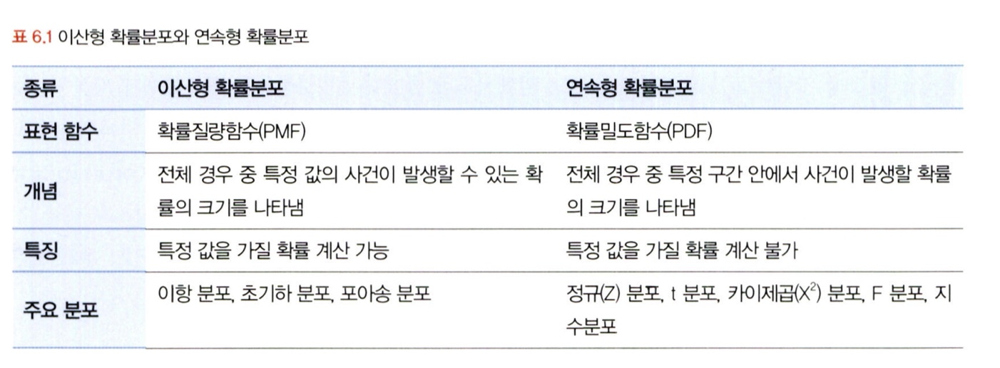

# 통계학 2주차 정규과제

📌통계학 정규과제는 매주 정해진 분량의 『*데이터 분석가가 반드시 알아야 할 모든 것*』 을 읽고 학습하는 것입니다. 이번 주는 아래의 **Statistics_2nd_TIL**에 나열된 분량을 읽고 `학습 목표`에 맞게 공부하시면 됩니다.

아래의 문제를 풀어보며 학습 내용을 점검하세요. 문제를 해결하는 과정에서 개념을 스스로 정리하고, 필요한 경우 추가자료와 교재를 다시 참고하여 보완하는 것이 좋습니다.

2주차는 `1부. 데이터 기초체력 기르기`를 읽고 새롭게 배운 내용을 정리해주시면 됩니다.

## Statistics_2nd_TIL

### 1부. 데이터 기초체력 기르기
### 06. 확률분포
### 07. 가설검정

## Study Schedule

| 주차  | 공부 범위     | 완료 여부 |
| ----- | ------------- | --------- |
| 1주차 | 1부 p.2~56    | ✅         |
| 2주차 | 1부 p.57~79   | ✅         |
| 3주차 | 2부 p.82~120  | 🍽️         |
| 4주차 | 2부 p.121~202 | 🍽️         |
| 5주차 | 2부 p.203~254 | 🍽️         |
| 6주차 | 3부 p.300~356 | 🍽️         |
| 7주차 | 3부 p.357~615 | 🍽️         |

<!-- 여기까진 그대로 둬 주세요-->

# 06. 확률분포

#### 확률분포

정의 : 확률변수가 특정 값을 가질 확률, **통계적 모형의 기본 토대**

가지는 값들의 특성에 따라 크게 **이산확률분포(discrete probablity distribution)**과 **연속확률분포(continuous probability distribution)**으로 구분. 

- 이산확률분포

확률질량함수(probability mass function)으로 표현. 대표적으로 이항 분포, 초기하 분포, 포아송 분포 등으로 나뉨

- 연속확률분포

확률밀도함수(probability mass function)으로 표현. 정규 분포, t분포, 카이제곱 분포, F분포, 지수분포 등이 있음.

> t분포 : 모집단이 정규분포를 하더라도 분산을 알 수 없고, 표본의 수가 적은 상태에서 평균에 대한 신뢰구간 추정 및 가설 검정에 쓰이는 분포로, 정규분포보다 꼬리가 약간 더 두꺼우며 자유도 n에 따라 형태는 조금씩 변함.
>
> > 자유도 n이 커질때마다 정규분포의 형태에 수렴함. 

<!-- Week2_1 이미지 추가 -->

## 6.2. 이산확률분포

#### 이산확률분포

이산확률 변수의 확률 분포, 실수와 같이 **명확한 값**을 갖는 분포

**1. 균등분포(uniform distribution)**

- 정의 : X가 동일한 확률을 가지는 분포

- 예시 : 주사위를 던져서 특정 숫자가 나오는 결과 => 1부터 6까지의 모든 경우가 다 1/6이다. 

**2.이항분포(binomial distribution)**

- 정의 : 이항(0또는 1) 적인 값만을 갖는 분포

- 예시 : 동전의 앞뒤, 성공 혹은 실패 

> - 베르누이 시행(Bernoulli trial) : 이항분포를 나타내는 결과가 두 가지 중 하나만 오는 시행으로, *각각의 결과가 독립적으로 이루어지기 때문에 처음에 0이 나왔다고 해서 다음에 나올 값에 영향을 받지 않는다.*

- 이항분포의 확률질량함수 

$$
P(X = k) = \binom{n}{k} p^k (1 - p)^{n - k}, \quad k = 0, 1, 2, \dots, n
$$

**3.초기하분포(hypergeometric distribution)**

- 정의 : 이항분포와 다르게, 각 시행이 서로 독립적이지 않은 분포, 

> 이항분포는 복원추출, 초기하분포는 비복원추출이다.

**4.포아송분포(poisson distribution)**

- 정의 : 일정한 관측 공간에서 특정 사건이 발생하는 횟수를 나타내는 이산확률분포
- 예시 : 품질관리나 보험상품 개발 등에 사용

- 특징  

1. 발생하는 사건은 양의 정수 형태를 가진다.
2. 모든 사건은 <u>독립적으로</u> 발생한다.
3. 해당 시공간에서 사건의 발생 비율은 항상 같다. (시공간이 두 배로 늘어나면 발생하는 사건도 두 배로 늘어난다.)
4. 한 번에 두 이상의 사건이 발생하지 않는다.

> 일정한 시공간 안에서 발생하는 사건의 횟수 => 0과 1 의 개념이 아니고, 표본의 크기라는 개념도 존재하지 않음. 

- 포아송분포의 확률질량함수

$$
P(X = k) = \frac{\lambda^k e^{-\lambda}}{k!}, \quad k = 0, 1, 2, \dots
$$

## 6.3. 연속확률분포

#### 연속확률분포

연속적인 공간 안에 확률변수가 가질 수 있는 값이 무수히 많아 이를 분포로 나타낸 것, 확률밀도곡선이라고도 표현함.

확률을 구하기 위해 **확률밀도함수(Probability Density Functions, PDF)**를 사용하고 특정 면적을 *적분* 하여 분리해 면적의 구간 안에서 사건이 발생할 확률을 계산함. 

**1. 정규분포(normal distribution)**

- 정의 : 가장 대표적인 정규분포

> 오차의 확률 분포가 정규 곡선과 같다는 것을 증명한 가우스의 이름을 따서 가우스 분포(Gaussian distribution)이라고도 부름.

- 특징

1. 평균과 표준편차에 따라 형태가 다르긴 하지만, 평균을 중심으로 좌우 대칭의 종 모양의 형태를 가지고 있음.
2. **평균, 중앙값, 최빈값**의 값이 다 같음.
3. 평균을 기준으로 좌우 1표준편차 안에 68%의 확률변숫값이 포함되어 있음.

- 표준정규분포(standard normal distribution) : 분포의 평균과 분산에 따라 혀ㅇ태에 차이가 나서 이를 *'표준화'*시킨 것
- 표준화 : 평균을 0, 분산을 1로 형태로 변환

**2. 지수분포(exponential distribution)**

- 정의 : 특정 사건이 발생한 시점으로부터 다음 사건이 발생할 때까지의 시간을 확률변수값으로 하는 분포

> 포아송분포 : 특정 사건이 발생하는 횟수, 지수분포 : 다음 사건이 일어날 때까지의 대기 시간

- 공식

$$
f(x) =
\begin{cases}
\lambda e^{-\lambda x}, & x \geq 0 \\
0, & x < 0
\end{cases}
$$

## 6.4. 중심극한정리

#### 중심극한정리

중심극한정리(Central Limit Theorem, CLT) : 데이터 크기 (n)가 일정한 양을 넘으면, 평균의 분포는 **정규분포에 근사**하다는 이론

즉, 무작위로 표본을 여러 번 추출한 다음, 추출된 각각의 표본들의 평균을 분포로 그려보면 정규분포의 형태를 가짐.

- 특징

> 전수 조사 없이도 표본 평균의 분포를 알 수 있으므로 모집단 평균에 대한 신뢰 구간을 더 쉽게 얻을 수 있음.
>
> 모집단 분포가 심하게 치우쳐 있거나 극단적인 경우에 표본 평균의 정규 분포를 다렁하기 위해 더 많은 표본이 필요할 수 있음.

# 07. 가설검정

#### 가설(Hypothesis)

- 정의 : 검정하고자 하는 주제, *연구문제에 대한 잠정적 결론*

> 대부분의 연구나 데이터 분석은 알고 싶은 정답을 미리 가설로 설정하고, 그 가설이 정말 맞는지를 검정하는 방식으로 진행함.

데이터 분석의 4가지

1. **기술적 분석(Descriptive Analytics)** : 과거나 현재에 어떤 일이 일어났는지를 파악하기 위한 분석, 데이터의 분포, 추세 등을 분석해 상황을 모니터링함.
2. **진단적 분석(Diagnostic Analytics)** : 과거나 현재에 발생한 사건의 원인을 밝히기 위한 분석, 데이터 간의 관계를 분석해 인과관계를 찾음
3. **예측 분석(Predictive Analytics)** : 기계학습이나 모델 등을 사용해 미래에 어떤 일이 어느 정도의 확률로 일어날지를 예측하는 *현재는 알 수 없는 결과의 가능성*을 파악함.
4. **처방적 분석(Prescriptive Analytics)** : 예측되는 미래의 결과를 위해 어떻게 처방할지에 대한 분석, 제한된 자원으로 최적의 성과를 내도록 방향을 도출

> 기술적 분석을 제외하고는 모두 가설 설정이 필요함. 

- 가설의 종류

#### 귀무가설(Null hypothesis)

새로이 증명하고자 하는 가설과 반대되는 가설로 <u>증명하고자 하는 가설과 반대되는 가설로써, 효과와 차이가 없는 가설을 의미</u>

#### 대립가설(Alternative hypothesis)

귀무가설과 대립되는 결과에 대한 가설로, 귀무가설이 기각될 때 <u>대안적으로 채택되는 가설(귀무가설과 반대되는 가설)</u>

> 두 개의 가설은 1900년대 중반 로널드 피셔라는 사람이 정의한 개념

#### 가설검정의 절차

<!-- Week2_2 이미지 추가 -->

- 먼저, 검정하고자 하는 가설을 설정한다.

> 여기서 귀무가설은 '차이가 없다.', '영향력이 없다.', '연관성이 없다' 와 같이 설정하고, 대립가설은 '차이가 없다', '영향력이 있다.', '연관성이 있다' 와 같이 설정

- 유의수준을 결정한다. (**0.1, 0.05, 0.01** )

> 유의수준이란? 귀무가설이 맞거나 틀린 것을 판단하기 위한 통계값

- 통계모델을 통해 실험을 수행하여 통계적 검증을 통해 **유의확률, 즉 p값(p-value)**을 산출한다.
- 유의수준과 p값을 비교해 가설 채택을 결정한다. 

#### 가설검정

- 정의 : 모집단에 대한 가설이 통계적으로 옳은가를 판별하기 위한 방법, 귀무가설에 대한 p값(p-value)이 유의수준 안에 들어오는지에 따라 가설의 기각과 채택을 판별함. 

<!-- Week2_3 이미지 추가 -->

**가설검정에 의한 p값이 유의수준보다 적은 값으로 나오면 귀무가설을 기각하고, 그 이상으로 나오면 귀무가설을 채택한다.**

> 유의수준(Significance level)이랑 반대되는 기준은 신뢰수준(Confidence level) 으로 둘이 합치면 100%

- 종류 : 귀무가설의 기각역을 어느 쪽으로 설쩡하느냐에 따라 

왼쪽꼬리, 오른쪽 꼬리 검정(**단측검정**)과 **양측검정**으로 나뉨. 주로 양측검정보다는 단측 검정을 시행하는 것이 더 바람직함.

#### 1종 오류와 2종 오류

가설검정이 항상 100% 확실하다고 할 수 없기에 생기는 오류가 있다. 

- 종류

**1. 1종 오류(Type I Error)**

​	귀무가설이 참임에도 불구하고 귀무가설을 기각하는 오류, *실제로 효과가 없는데 효과가 있다고 판단*

​	ex) 약품에 대한 테스트 결과를 필요로 할 때 중요

$$
\alpha = P(\text{reject } H_0 \mid H_0 \text{ is true})
$$

**2. 2종 오류(Type II Error)**

​	귀무가설이 거짓임에도 불구하고 귀무가설을 채택하는 오류, *실제로 효과가 있는데 효과가 없다고 판단*

​	ex) 암 진단과 같이 병이 있는데 없다고 진단되면 안되는 경우에 중요

$$
\beta = P(\text{fail to reject } H_0 \mid H_1 \text{ is true})
$$

두 개의 관계는 **트레이드오프 관계**이다. 

> 표본의 크기가 동일한 상태에서 하나를 증가시키면 하나가 감소한다. 

 
 

# 확인 문제

## 문제 1.

> **🧚Q. 다음 중 귀무가설(H₀)을 기각해야 하는 경우는 언제인가요? 정답을 고르고, 그 이유를 간단히 설명해주세요.**

> **1️⃣ 유의수준(α)이 0.05이고, p값이 0.03일 때   
> 2️⃣ 유의수준(α)이 0.01이고, p값이 0.02일 때**

정답은 **1번** 입니다. 

책을 보면 알 수 있는 것이 귀무가설을 기각하는 기준은 **p값이 유의수준보다  작을 때** 입니다. 그렇기에 1번과 같은 경우는 p값이 유의수준보다 작기에 귀무가설을 기각해야하며, 2번은 p값이 유의수준보다 0.01더 크므로 기각하면 안됩니다. 즉, 1번이 더 통계적으로 유의한 결과로 판단됩니다.

### 🎉 수고하셨습니다.