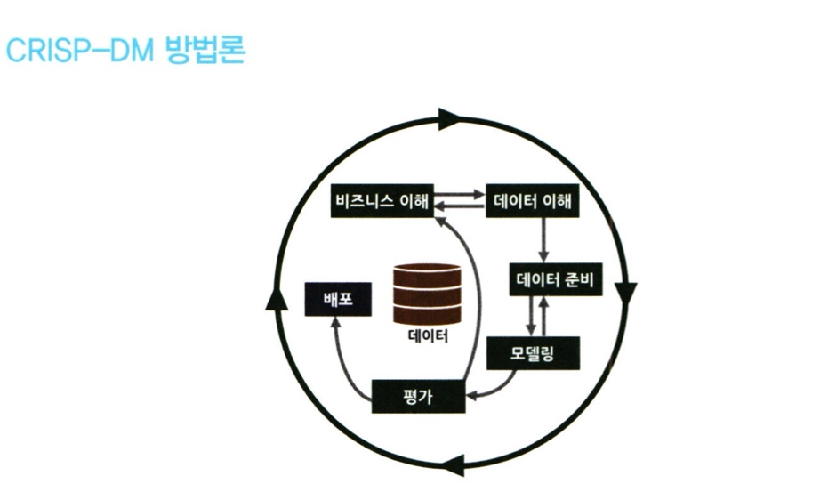

# 통계학 3주차 정규과제

📌통계학 정규과제는 매주 정해진 분량의 『*데이터 분석가가 반드시 알아야 할 모든 것*』 을 읽고 학습하는 것입니다. 이번 주는 아래의 **Statistics_3rd_TIL**에 나열된 분량을 읽고 `학습 목표`에 맞게 공부하시면 됩니다.

아래의 문제를 풀어보며 학습 내용을 점검하세요. 문제를 해결하는 과정에서 개념을 스스로 정리하고, 필요한 경우 추가자료와 교재를 다시 참고하여 보완하는 것이 좋습니다.

3주차는 `2부 데이터 분석 준비하기`를 읽고 새롭게 배운 내용을 정리해주시면 됩니다.

## Statistics_3rd_TIL

## Study Schedule

| 주차  | 공부 범위     | 완료 여부 |
| ----- | ------------- | --------- |
| 1주차 | 1부 p.2~56    | ✅         |
| 2주차 | 1부 p.57~79   | ✅         |
| 3주차 | 2부 p.82~120  | ✅         |
| 4주차 | 2부 p.121~202 | 🍽️         |
| 5주차 | 2부 p.203~254 | 🍽️         |
| 6주차 | 3부 p.300~356 | 🍽️         |
| 7주차 | 3부 p.357~615 | 🍽️         |

<!-- 여기까진 그대로 둬 주세요-->

---

## 2부 데이터 분석 준비하기

### 08. 데이터 분석 준비하기

#### 데이터 분석의 전체 프로세스

데이터 분석의 궁극적인 목표는 **의사결정 프로세스를 최적화**하는 것이다. 즉, **효과적인 결정을 할 수 있도록 도움을 주는 것이 데이터 분석의 주된 목적**이다. 

- **데이터 분석의 3단계**

<!-- Week3_1 이미지 추가 -->

**1. 설계 단계**

- 데이터 분석에 앞서 무엇을 하고자 하는지를 명확히 정의하고 프로젝트를 수행할 인력을 구성하는 단계
- 실무자와 분석가가 따로 존재

> - 실무자 : 데이터를 관리하고 활용하는 사람
> - 분석가 : 말 그대로 데이터 분석가

즉, 실무자와 분석가 간의 협의체계가 잘 이루어져있어야함.

**2. 분석 및 모델링 단계**

- 데이터 분석 및 모델링을 위한 서버 환경을 마련하고 본격적인 데이터 분석과 모델링을 하는 단계
- 데이터 추출, 검토, 가공, 모델링 등의 세부 절차와 부분 반복이 필요함.
- 책에서 다루는 내용 **CRISP-DM**과 **SEMMA** 방법론

**2 - (1). CRISP-DM **

<!-- Week3_2 이미지 추가 -->

**1단계 : 비즈니스 이해 (Business understanding)**

현재 상황을 평가하고, 데이터 마이닝에 대한 목표를 설정하며 프로젝트 계획을 수립하는 단계

**2단계 : 데이터 이해 (Data Understanding)**

데이터를 설명하고, 탐색하고, 품질 및 확인하는 단계

**3단계 : 데이터 준비 (Data Preparation)**

데이터를 선택하고 정제화하며 필수 데이터를 구성하고 데이터를 통합하는 단계

**4단계 : 모델링 (Modeling)**

모델링 기법을 선정하여 테스트 디자인을 생성하고, 모델을 생성해서 평가하는 단계

**5단계 : 평가 (Evaluation)**

결과를 평가하고, 프로세스를 검토하고, 다음 단계를 결정하는 단계

**6단계 : 배포 (Development) **

배포를 계획하며 모니터링 및 유지 관리를 계획하고, 최종 보고서를 작성하고 마지막으로 프로젝트를 검토하는 단계

**2 - (2). SAS SEMMA 방법론**

<!-- Week3_3 이미지 추가 -->

**1. Sampling 단계**

- 전체 데이터에서 분석용 데이터 추출
- 의미 있는 정보를 추출하기 위한 데이터 분할 및 병합
- 표본추출을 통해 대표성을 가진 분석용 데이터 생성
- 분석 모델 생성을 위한 학습, 검증, 테스트 데이터셋 분할

**2. Exploration 단계**

- 통계치 확인, 그래프 생성 등을 통해 데이터 탐색
- 상관분석, 클러스터링 등을 통해 변수 간의 관계 파악
- 분석 모델에 적합한 변수 선정
- 데이터 현황을 파악해 비즈니스 아이디어 도출 및 분석 방향 수정

**3. Modification 단계**

- 결측값 처리 및 최종 분석 변수 선정
- 로그변환, 구간화 등 데이터 가공
- 주성분분석 등을 통해 새로운 변수 생성

**4. Modeling 단계**

- 다양한 데이터마이닝 기법 적용에 대한 적합성 검토
- 비즈니스 목적에 맞는 분석 모델을 선정하여 분석 알고리즘 적용
- 지도학습, 비지도학습, 강화학습 등 데이터 형태에 따라 알맞은 모델 선정
- 분석 환경 인프라 성능과 모델 정확도를 고려한 모델 세부 옵션 설정

**5. Assessment 단계**

- 구축한 모델들의 예측력 등 성능을 비교 분석 평가
- 비즈니스 상황에 맞는 적정 임계치 설정
- 분석 모델 결과를 비즈니스 인사이트에 적용
- 상황에 따라 추가적인 데이터 분석 수행

**3. 구축 및 활용 단계**

- 최종적으로 선정된 분석 모델을 실제 업무에 적용하고 그 성과를 측정하는 단계 
- 모델이 적용된 후에 얼마나 기존보다 개선되었는지 효과를 측정하고 평가함.
- 주로 A/B 테스트를 통해 모델 성과 측정함.

요약 : **초반부에는 비즈니스 문제와 해결 방향을 명확히 정의하고 데이터를 탐색함. 중반부에는 데이터를 목적에 맞도록 수집 및 가공하고 필요에 따라 머신러닝 모델을 사용함. 후반부에는 데이터 분석 결과를 검토 및 검증하고 실제 화경에 적용함. 이후에는 지속적으로 모니터링하고 성과를 측정하고 보완하는 단계가 수반됨.**

#### 비즈니스 문제 정의와 분석 목적 도출

성공적인 데이터 분석 프로젝트를 위해서는 *프로젝트를 시작하기 전에 현재의 문제를 명확하게 정의하고, 그에 맞는 데이터 분석 목적을 설정* 해야한다. 

**채찍효과(Bullwhip effect)**란, 공급사슬에서수요 변동의 단계적 증폭 현상을 말하는데, 데이터 분서겡서도 작은 흔들림이 있어도 끝 부분에는 큰 파동의 현상이 생길 수 있다. 즉 **비즈니스 이해 및 문제 정의가 조금이라도 잘못되면 최종 인사이트 도출 및 솔루션 적용 단계에서 제대로 된 효과를 보기 힘들다.**

해결방법으로는 논리적 접근 방법으로 **MECE(Mutually Exclusive Collectively Exhaustive)**가 사용된다. 

<!-- Week3_4 이미지 추가 -->

사진과 같이 세부 정의들이 서로 겹치지 않고 전체를 합칠 때 빠진 것 없이 완전히 전체를 이루는 것을 의미한다.

일반적으로 **로직 트리(Logic Tree)**를 활용해 세부 항목을 정리한다. 

데이터 분석에 있어서 중요한 점은  **비즈니스 문제는 현상에 대한 설명으로 끝나서는 안되고, 본질적인 문제점이 함께 전달되어야한다는 것**이다. 그래서 프로세스로 분석 과제들을 도출한 후에 현재 상황에 맞는 우선순위를 측정해 프로젝트 과제를 수행한다. GE에서 개발한 문제해결 우선순위 결제방식은 **페이오프 매트릭스 (Pay off Matrix)**는 다음과 같다.

<!-- Week3_5 이미지 추가 -->

위와 같이 과제의 수익성과 실행 가능성 수준에 따라 2X2 네 개의 분면에 과제 우선순위를 표현한다. 

#### 분석 목적의 전환

비즈니스 문제와 분석 목적을 명확하게 정의하고 프로젝트를 시작한다고 해도 데이터 탐색을 하기 전까지 데이터에 숨겨져있는 정보와 인사이트를 확인하기가 어렵다. 따라서 **분석 프로젝트의 방향이 언제든 바뀔 수 있다는 것을 염두에 두어야 한다.** 또한, **분석 프로젝트를 수행하는 동안에는 실무자들 간의 커뮤니케이션 및 협력이 매우 중요하다.**

> 실제 실무에서 사용하는 방법인 것 같다. 데이터 분석 시 문제가 발생시에 바로바로 공유하며 수정해 나가는 것이 중요하다고 한다. 

#### 도메인 지식

기업에서 분석 프로젝트를 위한 인력 충원 방법은 크게 2가지이다.

1. 데이터 분석가를 새로 고용
2. 기존의 실무자나 신입사원을 교육시켜서 데이터 분석가로 만드는 방법

**도메인 지식(Domain Knowledge)** 이란, **해당하는 분야의 업에 대한 이해도**이다. 즉, 도메인 지식이 있는 사람과 없는 사람의 차이의 간극이 크다. 하지만 비즈니스 도메인과 관련이 없는 사람도 잘 하는 방법이 존재한다. 그건 **직접 의미 있는 변수를 찾아내고 분석 방향을 설정하는 것**이다. 그래도 도메인 지식을 넓히는데 힘을 들여야한다. 다음은 도메인 지식을 습득하는 방법들이다.

1. 프로젝트 초반에, 비즈니스 도메인에 소속된 실무자와 잦은 미팅과 함께 적극적인 질문과 자료 요청이 필요하다. 

- 어처구니 없는 실수들의 방지가 가능

2. 관련 논문들을 참고해 해당 도메인에 대한 심도 있는 지식을 습득하는 것

- 프로젝트와 유사한 주제의 논문에 사용된 방법론
- 데이터 마이닝 방법론, 관련 논문 레퍼런스를 통해 분석에 사용한 모델에 대한 보증

3. 현장에 방문해 데이터가 만들어지는 과정을 직접 보는 것

즉, 도메인마다 방법은 다르지만 **기본적으로 데이터가 생성되는 현장을 직접 보고 소비자 혹은 사용자의 입장이 되어 경험을 해보는 것이 좋다.**

#### 외부 데이터 수집과 크롤링

내부 데이터로는 데이터의 부족이 존재한다. 그렇기에 많은 기업들은 부족한 부분을 보완하기 위해 **외부 데이터를 수집하고 활용**한다. 

- 외부 데이터 수집 프로세스 예시

<!-- Week3_6 이미지 추가 -->

외부데이터 수집하는 방법 3가지

1. 데이터를 판매하는 전문 기업으로부터 필요한 데이터를 구매하거나 MOU 등을 통해 데이터를 공유하는 방법

- 비용이 많이 들고, 절차가 복잡함
- 정제된 고품질의 데이터를 얻을 수 있음

2. 공공 오픈 데이터를 제공하는 사이트에서 엑셀이나 csv형태로 데이터를 받아서 활용하는 방법

- 비용이나 노력이 크게 들지 않음
- 데이터를 원하는 형태로 가공하기 위한 리소스가 많이 듬.
- 활용성이 높은 데이터를 얻을 확률이 낮음.

3. 웹에 있는 데이터를 크롤링하여 수집하는 방법

- **크롤링** : 원하는 데이터를 실시간으로 자유롭게 수집할 수 있다는 장점, 데이터 수집을 위한 프로그래밍이 필요하며 해당 웹페이지가 리뉴얼 되면 이에 맞춰 수집 코드도 수정해야함.

- 법적인 이슈도 함께 고려해야함. 

**크롤링이란?**

<!-- Week3_7 이미지 추가 -->

- 스크래핑이라고도 부르며, Web 상을 돌아다니며 정보를 수집하는 것을 뜻함. 
- HTML 구조 (개발자도구 F12키)를 활용해 원하는 데이터가 있는 위치를 사전에 설정해 자동으로 반복적으로 특정 위치에 있는 텍스트를 수집하는 것 

---

### 09. 분석 환경 세팅하기

