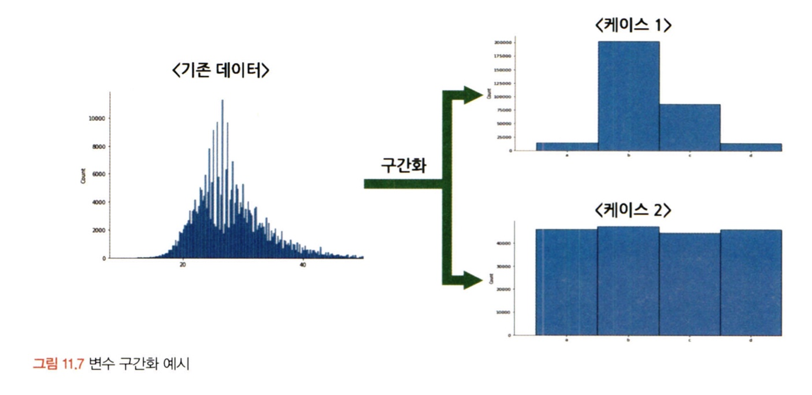
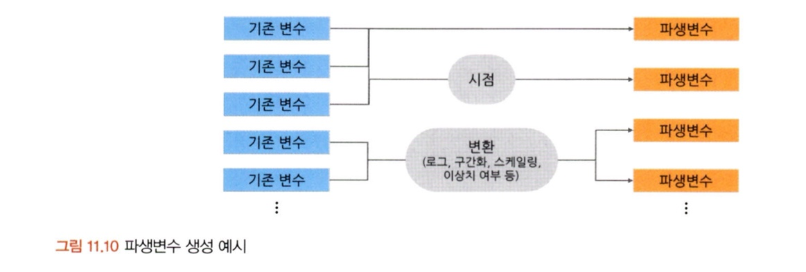

# 통계학 5주차 정규과제

📌통계학 정규과제는 매주 정해진 분량의 『*데이터 분석가가 반드시 알아야 할 모든 것*』 을 읽고 학습하는 것입니다. 이번 주는 아래의 **Statistics_5th_TIL**에 나열된 분량을 읽고 `학습 목표`에 맞게 공부하시면 됩니다.

아래의 문제를 풀어보며 학습 내용을 점검하세요. 문제를 해결하는 과정에서 개념을 스스로 정리하고, 필요한 경우 추가자료와 교재를 다시 참고하여 보완하는 것이 좋습니다.

5주차는 `2부. 데이터 분석 준비하기`를 읽고 새롭게 배운 내용을 정리해주시면 됩니다.

## Statistics_5th_TIL

### 2부. 데이터 분석 준비하기
### 11.데이터 전처리와 파생변수 생성

## Study Schedule

| 주차  | 공부 범위     | 완료 여부 |
| ----- | ------------- | --------- |
| 1주차 | 1부 p.2~56    | ✅         |
| 2주차 | 1부 p.57~79   | ✅         |
| 3주차 | 2부 p.82~120  | ✅         |
| 4주차 | 2부 p.121~202 | ✅         |
| 5주차 | 2부 p.203~254 | ✅         |
| 6주차 | 3부 p.300~356 | 🍽️         |
| 7주차 | 3부 p.357~615 | 🍽️         |

<!-- 여기까진 그대로 둬 주세요-->

# 11.데이터 전처리와 파생변수 생성

이번 장에서는 데이터 전처리를 위한 주요 방법들에 대해서 공부하였다. 

> 데이터 전처리가 왜 중요한가.?

- 결과적으로 데이터 분석과 머신러닝 모델링의 효과를 제대로 얻기 위해서는 **데이터 전처리 과정**이 매우 중요하다. 
- 잘못된 데이터는 통계적 편향을 증가시키므로, 의미있는 인사이트를 얻기가 힘들다. 

## 11.1. 결측값 처리
실제 분석 프로젝트에서 다루는 대부분의 데이터는 **결측값 (missing value)**이나 이상치가 없는 경우가 드물기 때문에 결측치 값을 처리해줘야 한다. 

- 결측값 처리 이전 해야하는 것들
  - 비중이 얼마나 되는지 확인하기 (1%미만이면 무시하고 분석해도 거의 무방)
  - 한 변수에 결측값이 몰려 있는지 확인 
  - 빈 문자열이 입력되어 있어서 결측값으로 인식되지 않는 값이 있는지도 확인하기

<!-- Week5_1 이미지 추가 -->

- 결측값 종류 (분석 환경에 따라 `..`, `NA`, `NAN` 등으로 표시)
  - **완전 무작위 결측 (MCAR : Missing Completely at Random)**
    - 이름 그대로 순수하게 결측값이 무작위로 발생한 경우
    - 편향성이 존재하지 않기 때문에 제거해도 괜찮은 성질을 가지고 있음.
  - **무작위 결측 (MAR : Missing at Random)**
    - 다른 변수의 특성에 의해 해당 변수의 결측치가 체계적으로 발생한 경우
  - **비무작위 결측 (NAMR : Missing at Not Random)** 
    - 결측값들이 해당 변수 자체의 특성을 갖고 있는 경우 

- 결측값 처리 방법

  - **표본 제거 방법 (Completes analysis)**

    - 결측값이 심하게 많은 변수를 제거하거나 결측값이 포함된 행을 제외하고 분석을 이어서 진행하는 방법 
    - 가장 단순한 방법
    - 전체 데이터의 결측값이 10% 미만일 경우에 사용하는 경우가 많음. 

  - **평균 대치법 (Mean Imputation)**

    - 결측값을 제외한 온전한 값들의 평균을 구한 다음에, 그 평균 값을 결측값들에 대치하는 방법
    - 사용하기가 간단하지만, 표준오차가 왜곡되어 축소되어 나타나고, p-value가 부정확하게 된다.

    > *표본 제거 방법*과 *평균 대치법*은 MCAR 를 제외한 경우 적절하지 않은 방법

  - **보간법 (Interpolation)**

    - 데이터가 시계열적 특성을 가지고 있을 때 사용
    - 전 시점 혹은 다음 시점의 값으로 대치하거나 그 시점의 평균 값으로 대치하는 방법
    - 시점 인덱스의 간격이 불규칙하거나 결측값이 두 번 이상 있는 경우에는 선형적인 수치값을 통해 계산함. 
    - **해당 변수와 다른 변수 사이의 관계성을 고려하여 계산하는 것이기에 합리적으로 결측치 처리가 가능**

  - **회귀 대치법 (regression imputation)**

    - 회귀식을 이용하여 결측값을 추정하는 방법
    - 추정하고자 하는 결측값을 가진 변수를 종속변수, 나머지 변수를 독립 변수로 추정하여 회귀식을 통해 결측값을 대치하는 방법
    - 결측된 변수의 분산을 과소 추정하는 문제가 있음. 

  - **확률적 회귀대치법 (stochastic regression)**

    - 인위적으로 회귀식에 확률 오차항을 추가하는 방법을 사용해 변동성을 조정함. 

  - **다중 대치법 (multiple imputation)**

    - 단순대치를 여러번 수행하여 n개의 가상적 데이터를 생성하여 이들의 평균으로 결측값을 대치하는 방법
    - 총 3가지 단게가 존재함. 

    1. 대치 단계 : 가능한 대치 값의 분포에서 추출된 서로 다른 값으로 결측치를 처리한 n 개의 데이터 셋 생성
    2. 분석 단계 : 생성된 각각의 데이터셋을 분석하여 모수의 추정치와 표준 오차 계산
    3. 결합 단계 : 계산된 각 데이터셋의 추정치와 표준오차를 결합하여 최종 결측 대치값 산출 

<!-- Week5_2 이미지 추가 -->

- 실습 중에 중요한 함수들 정리

`isnull().sum()`:  각 컬럼의 결측값 수를 산출

`dropna()`: 결측값의 관측치를 제거할 때 사용

- 모든 칼럼의 값이 결측값인 행을 제외할 때는 `how= 'all'`옵션을 사용
- 한 칼럼이라도 결측값인 행을 제외할 때는 `how = 'any' 옵션을 사용

`fillna()`: 결측값 대치할 때 사용, *mean, median, mode, max, min 등*의 옵션 사용 가능

`pad, bfill` : 보간법으로 사용할 때 사용

- 앞 시점의 첫 행이 결측값인 경우 데이터가 없기 때문에 대치가 안됨. 
- 그렇기에 우선 시간형 칼럼을 객체로 변환한 후에 인덱스로 설정하고, `interpolate()`함수를 통해 적용한 후에 사용해야함. 

## 11.2. 이상치 처리
**이상치 (outlier)** : 일부 관측치의 값이 **전체 데이터의 범위에서 크게 벗어난 아주 작거나 큰 극단적인 값을 갖는 것**을 말함.

- 모집단 평균이나 총합을 추정하는 것에 문제를 일으킴.
- 분산을 과도하게 증가시켜 모델링의 정확도를 감소시키기도 함. 
- 특성에 따라 다르지만, **전체 데이터의 양이 많을수록 튀는 값이 통계값에 미치는 영향력이 줄어들어 이상치 제거의 필요성이 낮아짐. **

<!-- Week5_3 이미지 추가 -->

- 이상치 제거 방법

  - 해당 값을 결측값으로 대채한 다음 결측값 처리를 하거나, **해당 이상치를 제거하는 (trimming) 것이 가장 간단**하다. 

  - **관측값 변경 (value modification)** : 위의 방법을 통해 편향 발생을 방지하기 위해 하한 값과 상한 값을 결정한 후에 하한 값보다 작으면 하한 값으로 대체하고, 상한 값보다 크면 상한 값으로 대체하는 방법

  - **가중치 조정 (weight modification)** : 이상치의 영향을 감소시키는 가중치를 주는 방법 

  - 평균은 이상치에 통계량이 민감하게 변하기 때문에, 이상치에 보다 강건한 중위수와 중위수 절대 편차를 사용하는 것이 더 효과적임. 

  - **중요** : 무조건적인 이상치 탐색은 위험하다. 

    > **해당 변수들의 의미와 비즈니스 도메인을 먼저 이해하고 이상치가 생긴 원인을 논맂거으로 생각하여 데이터를 바라봐야함. **
    >
    > - 때로는 **분석 도메인에 따라 이상치가 중요한 분석이 될 수도 있음.**

 

## 11.3. 변수 구간화

**변수 구간화 (Binding)** : 데이터 분석의 성능을 향상시키기 위해, 해석의 편리성을 위해 이산형 변수를 범주형 변수로 변환하는 방법

- 이산형 변수를 범주형 변수로 비즈니스적 상황에 맞도록 변환시킴으로써 데이터의 해석이나 예측, 분류 모델을 의도에 맞도록 유도할 수 있음. 
  - 동일폭으로 변수 구간화
  - 동일 빈도(n)으로 변수 구간화 가능
  - 구간별 평균 값으로 평활화
  - 구간별 중앙값으로 평활화
  - 구간별 경곗값으로 평활화

<!-- Week5_4 이미지 추가 -->

- 그 외의 방법 : **클러스터링, 의사결정나무**
  - 클러스터링 : 타깃 변수 설정이 필요없이 구간화할 변수의 값들을 유사한 수준끼리 묶어주기
  - 의사결정나무 : 타깃 변수를 설정해, 구간화할 변수의 값을 타깃 변수 에측에 가장 적합한 구간으로 나누어주기 
- 변숫값이 효과적으로 구간화했는지는 **WOE (Weight of Evidence)** 값을 통해 측정 가능하여 수치가 높을 수록 잘 구분한다는 정보량이 많다는 것이다. 

## 11.4. 데이터 표준화와 정규화 스케일링
표준화, 정규화 스케일링 : 독립 변수들이 서로 단위가 다르거나 편차가 심할 때 값의 스케일을 일정한 수준으로 변환시켜주는 방법

- 두 가지는 모두 특정 머신러닝의 모델의 학습 효율을 증가 시키기 때문에 많이 사용된다. 
- 범주화 알고리즘 인공신경망 모델에서도 학습 효율과 분류 성능을 높이기 위해 표준화나 정규화를 필수적으로 수행해줘야 한다. 

**1. 표준화 (Standardization)** 

- **각 관측치의 값이 전체 평균을 기준으로 어느 정도 떨어져 있는지 나타낼 때 사용**한다. 
- 평균은 0으로 변환
- Zero-mean 으로부터 얼마나 떨어져 있는지를 나타내기 때문에 이를 **Z-score**라고 표현한다. 

**2. 정규화 (Normalization)**

- **데이터의 범위를 0부터 1까지로 변환하여 데이터 분포를 조정하는 방법**
- 해당 값이 어떤 위치에 있는지 파악하는데 유용하다. 
- 0에 가까울 수록 작은 값, 1에 가까울수록 큰 값
- (해당 값 - 최솟값) / (최댓값 - 최솟값) 의 수식을 통해 사용

<!-- Week5_5 이미지 추가 -->

그 외. 

**3. RobustSclaer 기법**

- 기본 표준화 정규화 방식은 **이상치에 민감하다는 단점을 가지고 있기에 이를 보완한 기법**
- 데이터의 중앙값 (Q2)를 0으로 잡고, Q1, Q3 사분위수와 IQR 차이를 1이 되도록 하는 스케일링 기법

## 11.5. 모델 성능 향상을 위한 파생 변수 생성
**파생 변수 (Derived variable)** 

- 원래 있던 변수들을 **조합하거나 함수를 적용하여 새로 만들어낸 변수**를 뜻한다. 
- 파생 변수는 데이터 특성을 이용해 분석 효율을 높이는 것이기 때문에 전체 데이터에 대한 파악이 중요할 뿐만 아니라 해당 비즈니스 도메인에 대한 충분한 이해가 수반되어야 한다. 
  - 데이터 탐색 과정을 통해 증감률이 중요할 것으로 유추하는 것이 가능
  - 충분한 데이터 탐색 및 시각화 작업이 그 전에 반드시 필요하다.
- 기존의 변수를 활용해서 만들어낸 변수이기 때문에 **다중 공선성**문제가 발현할 가능성이 높다.
  - 만든 이후에는 변수 간의 상관성을 파악하는 것이 중요하다 

<!-- Week5_6 이미지 추가 -->

 
 

# 확인 문제

## 문제 1. 데이터 전처리

> **🧚 한 금융회사의 대출 데이터에서 `소득` 변수에 결측치가 포함되어 있다. 다음 중 가장 적절한 결측치 처리 방법은 무엇인가?**

> **[보기]   
> 1️⃣ 결측값이 포함된 행을 모두 제거한다.  
> 2️⃣ 결측값을 `소득` 변수의 평균값으로 대체한다.  
> 3️⃣ `연령`과 `직업군`을 독립변수로 사용하여 회귀 모델을 만들어 `소득` 값을 예측한다.  
> 4️⃣ 결측값을 보간법을 이용해 채운다.**

> **[데이터 특징]**     
>   - `소득` 변수는 연속형 변수이다.  
>   - 소득과 `연령`, `직업군` 간에 강한 상관관계가 있다.  
>   - 데이터셋에서 `소득` 변수의 결측 비율은 15%이다.

- 정답 : **3번 . 연령과 직업군을 독립변수로 사용하여 회귀 모델을 만들어 소득 값을 예측한다.**
  - 관련 변수로 연령, 직업군이라는 변수가 있기 때문에 **관련 변수를 통해 에측할 수 있는 회귀 모델이 더 높은 예측력을 가질 수 있다.**

1번 : 15%의 데이터를 가지고 있기 때문에 데이터를 제거하기에는 정보 손실이 크기에 부적합하다.

2번 : 평균 대체는 분산을 감소하고, 왜곡된 가능성이 있을 것이다. 

4번 : 소득과 관련된 부분에서는 시간적 순서가 중요하지 않기 때문에 사용하기에 부적합하다. 

## 문제 2. 데이터 스케일링

> **🧚 머신러닝 모델을 학습하는 과정에서, `연봉(단위: 원)`과 `근속연수(단위: 년)`를 동시에 독립변수로 사용해야 합니다. 연봉과 근속연수를 같은 스케일로 맞추기 위해 어떤 스케일링 기법을 적용하는 것이 더 적절한가요?**

<!--표준화와 정규화의 차이점에 대해 고민해보세요.-->

- 정답 : **Z-score Scaling** 이 가장 적절하다.

연봉과 근속연수는 우선 제일 중요하게 단위가 다르다. 또한 연봉은 단위가 원이기 때문에 단위가 수천만, 수억원이 될 수 있지만 근속 연수의 단위는 100이하일 가능성이 크다. 

즉 표준화를 통해서 평균을 0과 표준편차를 1로 맞추어 서로 다른 스케일의 변수들을 비교가 가능하게 하는 것이 가장 적절하다. 

정규화는 이상치에 너무 민감하고, Robust Scaling은 이상치가 매우 심할 가능성이 있기에 부적합하다. 

### 🎉 수고하셨습니다.