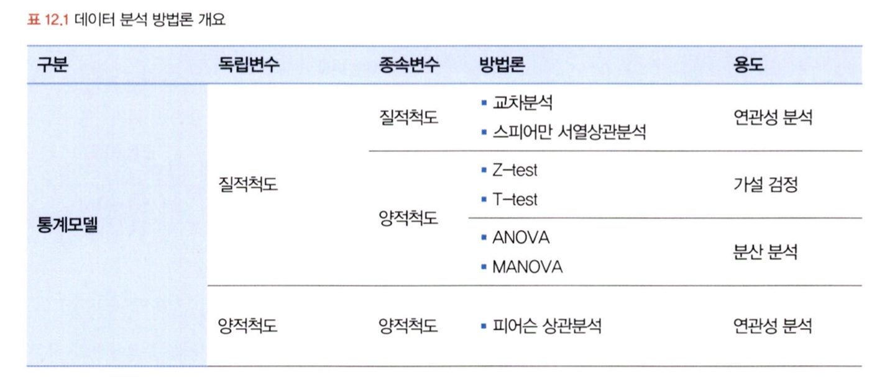
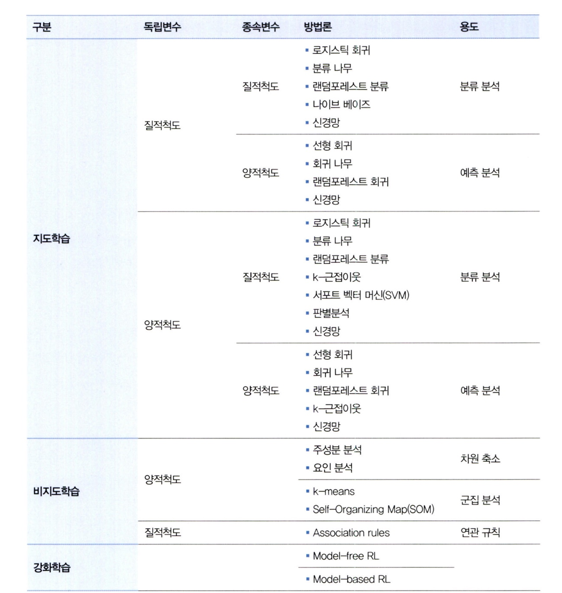
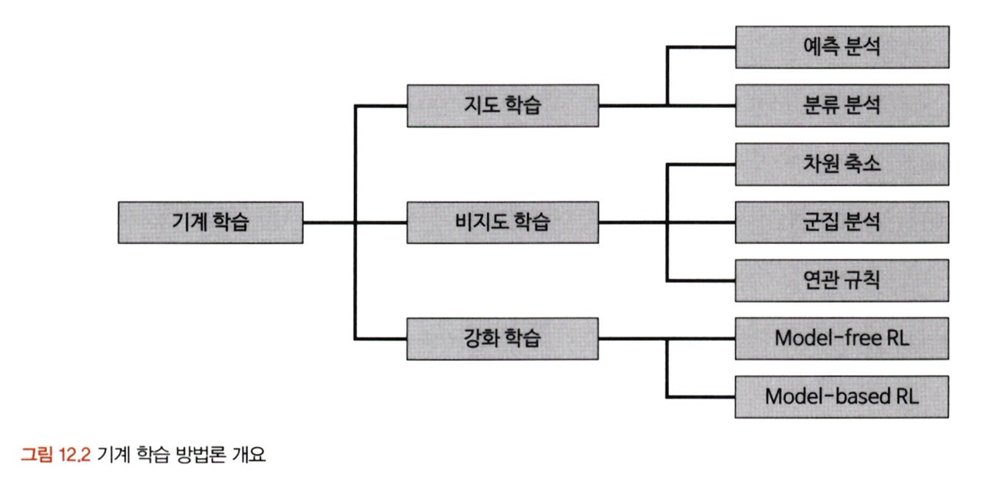

# 통계학 6주차 정규과제

📌통계학 정규과제는 매주 정해진 분량의 『*데이터 분석가가 반드시 알아야 할 모든 것*』 을 읽고 학습하는 것입니다. 이번 주는 아래의 **Statistics_6th_TIL**에 나열된 분량을 읽고 `학습 목표`에 맞게 공부하시면 됩니다.

아래의 문제를 풀어보며 학습 내용을 점검하세요. 문제를 해결하는 과정에서 개념을 스스로 정리하고, 필요한 경우 추가자료와 교재를 다시 참고하여 보완하는 것이 좋습니다.

6주차는 `3부. 데이터 분석하기`를 읽고 새롭게 배운 내용을 정리해주시면 됩니다.


## Statistics_6th_TIL

### 3부. 데이터 분석하기
### 12.통계 기반 분석 방법론


## Study Schedule

| 주차  | 공부 범위     | 완료 여부 |
| ----- | ------------- | --------- |
| 1주차 | 1부 p.2~56    | ✅         |
| 2주차 | 1부 p.57~79   | ✅         |
| 3주차 | 2부 p.82~120  | ✅         |
| 4주차 | 2부 p.121~202 | ✅         |
| 5주차 | 2부 p.203~254 | ✅         |
| 6주차 | 3부 p.300~356 | ✅         |
| 7주차 | 3부 p.357~615 | 🍽️         |

<!-- 여기까진 그대로 둬 주세요 -->

 학습 목표 :
* 주성분 분석(PCA)의 개념을 설명할 수 있다.
* 다중공선성을 진단할 수 있다.
* Z-TEST와 T-TEST의 개념을 비교하고, 적절한 상황에서 검정을 설계하고 수행할 수 있다.
* ANOVA TEST를 활용하여 세 개 이상의 그룹 간 평균 차이를 검정하고, 사후검정을 수행할 수 있다.
* 카이제곱 검정을 통해 범주형 변수 간의 독립성과 연관성을 분석하는 방법을 설명할 수 있다.

# 12.통계 기반 분석 방법론

## 12.1. 분석 모델 개요
주요 데이터 분석 방법론들을 보면 크게 두 축으로 나누어진다. 

- 통계학에 기반한 통계 모델 (Statistical model)
  - **모형과 해석을 중요하게 생각**하며, **오차와 불확정성을 강조**한다. 
- 인공지능에 파생된 기계 학습 (Machine learning)
  - **대용량 데이터를 활용하여 예측의 정확도를 높이는 것을** 중요하게 생각한다. 

> 기계학습은 통계 모델 기반을 활용할 때 높은 성과를 얻으므로, 두 방법 다 제대로 익히고 하는 것이 좋다. 

다음은, 데이터 분석 방법론의 개요이다. 

<!-- Week6_1 이미지 추가 -->



<!-- Week6_2 이미지 추가 -->



기계 학습 데이터 분석 방법론을 두 가지 기준으로 구분이 가능하다. 

- **종속변수의 유무에 따라**

  - **지도학습 (Supervised learning)**
    - 입력에 대한 정답이 주어져서 출력된 결과값과 정답 사이의 오차가 줄어들도록 학습과 모델 수정을 반복한다. 
    - 양적 척도면 회귀 방식 / 결과값이 질적척도면 분류 방식의 방법론 사용
  - **비지도학습 (Unsupervised learning)**
    - 자율학습이라고 불리며, **별도의 저답이 없이 변수 간의 패턴을 파악하거나 데이터를 군집화하는 방법**
    - **크게 차원축소, 군집 분석, 연관 규칙**으로 나눌 수 있다. 
      - **차원 축소** : 지도학습시에 학습 성능을 높이기 위한 전처리 방법으로 사용되는 경우가 많다.
      - **군집 분석** : 정답지 없이 유사한 관측치들끼리 군집으로 분류하는 기능이다. 
      - **연관 규칙** : 제품이나 콘텐츠를 추천하기 위해 사용하는 모델

  - **강화학습 (Reinforcement learning)**
    - **동물이 시행착오를 통해 학습하는 과정을 기본 콘셉트로 한 방법 중 하나이다.**

<!-- Week6_3 이미지 추가 -->



- **독립 변수와 종속변수의 속성에 따라**

> 하나의 방법론이 **양적, 질적 변수 형태에** 모두 사용가능한 경우도 존재함. 
>
> - ex) 회귀 모델(변수 가공 이후)


## 12.2. 주성분 분석(PCA)

## PCA (주성분 분석)

 : **여러 개의 독립변수들을 잘 설명해 줄 수 있는 주된 성분을 추출하는 기법**

- 전체 변수들의 핵심 특성만 선별하기 때문에, 독립변수의 **차원의 수**를 줄일 수 있다.
- **차원의 저주** 방지 해준다. 
- 사용되는 변수들은 등간 척도나 비율척도로 측정한 양적변수이여야하고, 관측치들이 서로 독립적이고 정규분포를 이루고 있어야 한다. 

- 차원 감소 방법 2가지

  - 변수 선택을 통해 비교적 불필요하거나 유의성이 낮은 변수를 제거하는 방법 
  - 변수들의 잠재적인 성분을 추출하여 차원을 줄이는 방법

  > **공통요인분석 (Common Factor Analysis : CFA)**는 2번째에 해당

- PCA 하는 방법

1. 데이터 공간에 위치하는 점들의 분산을 최대한 보존하는 축을 통해 차원을 축소하는 것이 핵심
2. 전체 변수를 통합적으로 가장 잘 설명해주는 성분변수, 그 다음으로 높은 변수 등 주성분 변수만 선정해 총 변수의 개수를 줄인다. 

> 일반적으로는 제1, 제2 주성분만으로 대부분의 설명력이 포함되기 때문에 두 개의 주성분만 선정한다. 

사진으로 나타내면 다음과 같다. 

<!-- Week6_4 이미지 추가 -->


<!-- Week6_5 이미지 추가 -->


<!-- Week6_6 이미지 추가 -->


## 12.3. 공통요인분석 (CFA)

PCA, CFA는 요인분석을 하기 위한 기번의 종류 = 말 그대로 주어진 데이터의 요인을 분석한다 

> 여기서 전체 분산을 토대로 요인을 추출하는 PCA를 사용하거나, 공통분산만을 토대로 요인을 추출하는 CFA를 선택이 가능하다. 

- **탐색적 요인분석 (Explratory Factor Analysis)** 
  - 변수와 요인 간의 관계가 사전에 정립되지 않거나 체계화되지 않은 상태에서 변수 간의 관계를 알아보기 위해 사용한다. 
- **확인적 요인분석 (Confirmatory Factor Analysis : CFA)**
  - 이미 변수들의 속성을 예상하고 있는 상태에서 실제로 구조가 그러한지 확인하기 위한 목적으로 사용한다.
  - 선행연구를 통해 밝혀진 변수의 속성을 활용해 측정변수와 잠재변수 간의 관계를 검정 및 확인하기 위해 사용한다. 
  - 전체 독립변수를 축약한다는 점에서 PCA와 동일하지만, 상관성이 높은 변수들은 묶어 잠재된 몇 개의 변수를 찾는다는 점에서 차이가 있다. 


## 12.4. 다중공선성 해결과 섀플리 밸류 분석
### 다중공선성 (multicollinearity) 

- **독립변수들 간의 상관관계가 높은 현상**으로, 서로 선형적인 관계를 나타낼 때를 말한다.
- 독립변수들 간에 서로 독립이라는 회귀분석의 전체 가정을 위반하게 된다. 
- 회귀분석에서 추정치의 통계적 유의성이 낮아져 모델의 정합성이 맞지 않는 문제가 발생하게 된다. 


*판별 기준*

- 독립 변수간의 상관성을 확인하여 높은 상관계수를 갖는 독립변수를 찾아내야한다.

  - 상관계수의 절대치가 **0.7**이면 두 변수간의 상관성이 높다고 본다. 

- 독립변수들의 설명력을이해하는 **결정계수** 값이 크지만, **t값 (t-value)**가 낮다면 의심해볼 수 있다.

  - 각 계수 추정치의 표준표차가 크다는 것은 독립변수 간에 상관성이 크다는 것을 의미하기 때문이다. 

  - t 값은 해당변수의 시그널의 강도라고 할 수 있기에, **값이 클수록 좋다.**

    > 기준이 1.96이상이면 적절하다고 판단한다.

<!-- Week6_7 이미지 추가 -->


- **VIF (Variance Inflation Factor)** , 즉 **분산팽창계수**를 통해서도 판단할 수 있다. 
  - 모델에 사용된 다른 독립 변수들이 해당 변수 대신 모델을 설명해줄 수 있는 정도를 나타낸다. 
  - 해당 변수가 다른 변수들에 의해 설명될 수 있는 정도를 의미한다. 


**다중공선성을 해결하기 위한 방법**

- **VIF 값이 높으면서 종속변수와의 상관성이 낮은 변수를 제거한다.**
  -  그 이후 다시 VIF 값을 확인하는 것을 반복한다. 
  - 여기서는 가설과 비즈니스적 요소도 함께 고려해야한다
- **표본 관측치를 추가적으로 확보한다.**
  - 분석 모수가 많아질수록 회귀계수의 분산과 표준편차가 감소하기 때문이다.
- **로그, 표준화 등을 통한 변수를 가공한다.**
- **주성분 분석을 통한 변수를 축약한다.**
- **변수 선택 알고리즘을 활용해 적정 변수를 자동 선정한다.**


### 새플리 밸류 (Shapley Value) 분석

- 각 독립변수가 종속변수의 설명력에 기여하는 순수한 수치를 계산하는 방법
- 해당 변수를 모델에 투입할 때 설명력에 어느정도의 기여를 하는지 측정할 수 있는 기준 값이다. 
- 예를 들어 독립변수 x1,x2,x3 와 종속변수 y간의 관계를 분석한다고 했을 때 아래의 조합이 나왔다고 가정해보자. 

<!-- Week6_8 이미지 추가 -->


해석하면 다음과 같다.

> x1 단일 조합에서 x1의 기여도 : 0.15
>
> x1,x2와 x1,x3 두 변수 조합에서 x1의 기여도 평균 : 0.115
>
> x1,x2,x3 조합에서의 x1 기여도 : 0.04
>
> 새플리 밸류 : 0.101 


## 12.6. Z-test와 T-test
통계기반 데이터 분석의 기본 방법론  : Z-test, T- test, ANOVA 

### Z-test & T-test

- 두 집단 간의 평균 차이를 분석할 때 사용한다. (ANOVA는 두 집단 이상일 경우에 사용)
- **단일 표본 집단의 평균 변화를 분석하거나 두 집단의 평균값 혹은 비율 차이를 분석할 때 사용**
- 분석하고 자하는 변수가 **양적 변수, 정규 분포, 등분산이라는 조건이 충족**되어야 한다. 
  - Z-test : 본래 모집단의 분산을 알 수 있는 경우에 사용되며, 모집단의 분산을 알 수 있는 경우는 보통 거의 없다. 따라서 표본의 크기가 30이상이면 중심극한정리에 의해 평균분포가 정규분포를 따른다고 볼 수 있기 때문에 Z-test 사용이 가능하다. 
  - T-test : 표본의 크기가 30 미만이여도 표본 집단의 정규분포를 가정할 수 없을 때 사용된다. 30이상에서도 사용이 되기 때문에 일반적으로 사용한다. 

<!-- Week6_9 이미지 추가 -->


## 12.7. ANOVA
### ANOVA (Analysis Of Variance )

- 세 집단 이상의 평균 차이를 검정할 때 사용한다. 
- 분산 분석이라고 불리며, **F분포**를 사용한다. 
  - F분포를 통해 독립변수가 종속변수에 미치는 영향을 분석한다. 
- 일반적인 가설은 다음과 같은 형태이다. 
  - **귀무가설 : 독립변수의 차이에 따른 종속변수는 동일하다.**
  - **대립가설 : 독립변수의 차이에 따른 종속변수는 다르다.**
- 각 집단의 평균값 차이가 통계적으로 유의한지 검증한다. 분산이 큰 정도를 따져 집단 간 평균이 다른지를 판별한다. 
- 즉, **집단 내 분산이 사용되며**, 전체 집단의 통합 평균과 각 집단의 평균값이 얼마나 퍼져 있는지를 나타내는 **집단 간 평균의 분산이 사용**된다. 

<!-- Week6_10 이미지 추가 -->


<!-- Week6_11 이미지 추가 -->


## 12.8. 카이제곱 검정(교차분석)

### 카이제곱 검정 (Chi-square test)

- 명목 혹은 서열척도와 같은 범주형 변수들 간의 연관성을 분석하기 위해 결합분포를 활용하는 방법이다. 
- 변수들 간의 범주를 동시에 교차하는 교차표를 만들어 각각의 빈도와 비율을 통해 변수 상호 간의 독립성과 관련성을 분석하는 것이다. 
- **교차 분석은 상관분석과는 다르게 연관성의 정도를 수치로 표현할 수 있다.**
- 검정 통계량 카이제곱을 통해 변수 간에 연관성이 없다는 귀무가설을 기각하는지 여부로 상관성이 있고 없음을 판단한다. 


<br>
<br>

# 확인 문제

### **문제 1.**
> **🧚 경희는 다트비 교육 연구소의 연구원이다. 경희는 이번에 새롭게 개발한 교육 프로그램이 기존 프로그램보다 학습 성취도 향상에 효과적인지 검증하고자 100명의 학생을 무작위로 두 그룹으로 나누어 한 그룹(A)은 새로운 교육 프로그램을, 다른 그룹(B)은 기존 교육 프로그램을 수강하도록 하였다. 실험을 시작하기 전, 두 그룹(A, B)의 초기 시험 점수 평균을 비교한 결과, 유의미한 차이가 없었다. 8주 후, 학생들의 최종 시험 점수를 수집하여 두 그룹 간 평균 점수를 비교하려고 한다.**   

> **🔍 Q1. 이 실험에서 사용할 적절한 검정 방법은 무엇인가요?**

```
독립표본 t- 검정을 사용해야한다. 
그룹 A와 B는 독립된 집단이며, 8주 후에 평균 차이를 비교하는 것이기 때문이다. 
```

> **🔍 Q2. 이 실험에서 설정해야 할 귀무가설과 대립가설을 각각 작성하세요.**

```
귀무가설 : 두 교육 프로그램의 최종 시험 점수 평균은 같다.
대립가설 : 두 교육 프로그램의 최종 시험 점수의 평균은 다르다. 
```

> **🔍 Q3. 검정을 수행하기 위한 절차를 순서대로 서술하세요.**

<!--P.337의 실습 코드 흐름을 확인하여 데이터를 불러온 후부터 어떤 절차로 검정을 수행해야 하는지 고민해보세요.-->

```
1. 각 그룹의 최종 점수 데이터를 수집한다.
2. 두 그룹의 정규성과 등분산성을 검정하여 t 검정을 수행한다. 
3. p-value 를 기준으로 귀무사설 기각 여부를 결정한다. 
4. 결과를 해석한다. (유의수준을 통해 두 그룹 간의 평균 차이가 유의한지 판단한다.)
```

> **🔍 Q4. 이 검정을 수행할 때 가정해야 하는 통계적 조건을 설명하세요.**

```
두 집단은 서로 독립적이여야 하고, 각 집단의 데이터는 정규분포를 따라야한다. 그리고 두 집단의 분산은 같아야한다. 
```

> **🔍 Q5. 추가적으로 최신 AI 기반 교육 프로그램(C)도 도입하여 기존 프로그램(B) 및 새로운 프로그램(A)과 비교하여 성취도 차이가 있는지 평가하고자 한다면 어떤 검정 방법을 사용해야 하나요? 단, 실험을 시작하기 전, C 그룹의 초기 점수 평균도 A, B 그룹과 유의미한 차이가 없었다고 가정한다.**

```
세 개 이상의 그룹 평균을 비교하기 때문에 일원분산분석 ANOVA가 적절하다. 
```

> **🔍 Q6. 5번에서 답한 검정을 수행한 결과, 유의미한 차이가 나타났다면 추가적으로 어떤 검정을 수행해 볼 수 있을까요?**

```
사후검정을 더 해야한다. 
어떤 그룹들 간에 차이가 있는지를 확인하기 위해 Tukey's HSD와 같은 사후검정을 수행해야한다. 
```

---

### **문제 2. 카이제곱 검정**  
> **🧚 다음 중 어떠한 경우에 카이제곱 검정을 사용해야 하나요?   
> 1️⃣ 제품 A, B, C의 평균 매출 차이를 비교하고자 한다.  
> 2️⃣ 남성과 여성의 신체 건강 점수 평균 차이를 분석한다.  
> 3️⃣ 제품 구매 여부(구매/미구매)와 고객의 연령대(10대, 20대, 30대…) 간의 연관성을 분석한다.  
> 4️⃣ 특정 치료법이 환자의 혈압을 감소시키는 효과가 있는지 확인한다.**  

```
정답은 3번. 제품 구매여부와 고객의 연령대 간의 연관성을 분석한다. 입니다. 
두 변수간의 통계적으로 연관이 있는지 확인하는 것이기 때문이다.

1. 일원분산분석 / 2. 독립표본 t-검정 / 3. 대응표본 t-검정이 적절하다. 
```

### 🎉 수고하셨습니다.